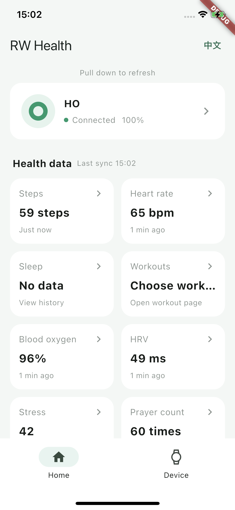
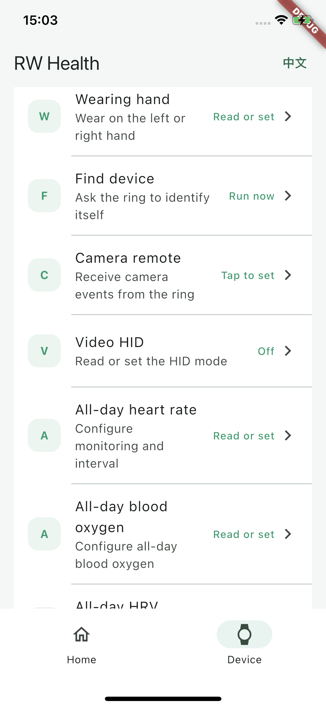

# RWFit Flutter Plugin

A cross-platform Flutter BLE plugin for RWFit smart rings. It bridges the RWFit
native SDK and supports Android and iOS.

## Features

- Device scanning, connection, reconnection, and unbinding
- Health data synchronization and real-time measurement
- Capability-aware device settings
- Workout tracking and real-time workout data
- Raw PPG data collection and history retrieval
- Firmware upgrades using a local firmware path

## Example

The example app demonstrates the plugin's primary workflows and supports both
English and Chinese. Use the language switch in the upper-right corner to change
the display language.

<p align="center">
  
  
</p>

## Installation

Add the plugin as a Git dependency and pin it to a release tag:

```yaml
dependencies:
  rwfit_ble:
    git:
      url: https://github.com/RWFitSDK/RW_flutter_plugin.git
      ref: v0.0.5
```

Then fetch the dependency:

```shell
flutter pub get
```

## Documentation

- [Integration Guide (English)](doc/integration_guide_en.md)
- [集成文档（中文）](doc/integration_guide_zh.md)

## Native SDK Version

This release includes `RW_SDK_V2.0.0_20260724`.

## License

MIT License
