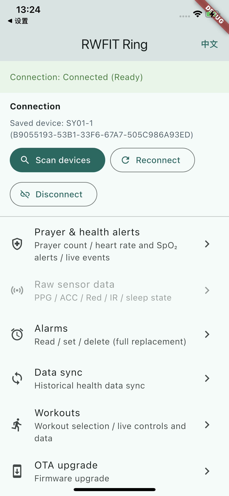

# RW Flutter Plugin

RWFit Flutter 原生蓝牙插件 — 基于 Flutter 的跨平台 BLE 桥接插件，支持 Android 和 iOS。

当前插件基于原生 SDK 版本：`RW_SDK_V2.0.0_20260724`。

## 示例 / Example

示例 App 支持中文和英文，可在页面右上角切换语言。

The example app supports Chinese and English, with a language switch in the
upper-right corner.

  

## 文档 / Documentation

- [集成文档（中文）](doc/integration_guide_zh.md)
- [Integration Guide (English)](doc/integration_guide_en.md)

## License

MIT License
